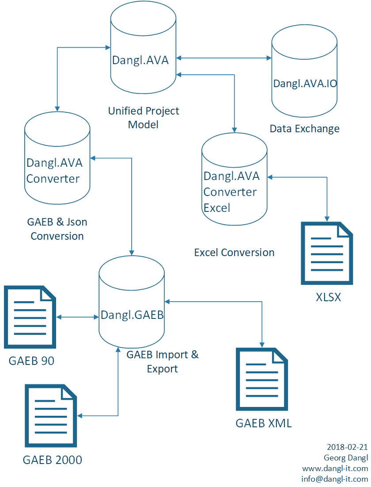

# Dangl.AVA.Examples

> An online version of the converter is freely accessible at [my blog](https://blog.dangl.me/gaeb-converter/)

This is a _demonstration_ library intended to show the usage of the Dangl.AVA and Dangl.GAEB projects.
To build this solution, you need to copy four packages into the `./packages` folder, relative to the root of this project:
* Dangl.AVA
* Dangl.GAEB
* Dangl.AVA.Converter
* Dangl.AVA.Converter.Excel

These packages are not included in this repository.
This project is intended to demonstrate the usage of the Dangl.AVA and Dangl.GAEB libraries.

## CLI Interface

The console application is launched via

    Dangl.AVA.Examples.exe -i <InputFile> -o <OutputFile> -t <Target> [-s] [-e]

| Parameter | Description |
|-----------|-------------|
| -i | Path to an input file. Can be any GAEB file or an Excel file created by this tool |
| -o | Path of the output file without extension. Will overwrite existing files |
| -t | Transformation target, can be either `Excel`, `Gaeb90`, `Gaeb2000` or `GaebXml`|
| -s | Optional, if included, all prices, taxes and deductions are stripped from the output|
| -e | Optional, if included, the output files will not have a comment with a branding of the library |

## Additional Samples

The unit test project in `test/Dangl.AVA.Examples.Tests` contains additional example code,
such as roundtripping and simple reading of GAEB files.

## Library Key Features

* Can read all GAEB90, GAEB2000 and GAEB XML files. The GAEB library includes a lot of code that can recover from errors that were found in files out in the wild
* Hassle-free import: Just pass the `Stream` of the file to the converter, format detection and error recovery happens automatically
* **Dangl.GAEB** provides a native interface to all features of GAEB files, allowing native operation directly on the GAEB file
* **Dangl.AVA** offers a unified data model that can be bi-directionally imported or exported to via **Dangl.AVA.Converter** between GAEB, Excel and Json
* Advanced heuristics allow the preservation of most information even when converting to an earlier version of the GAEB standard
* Complete `INotifyPropertyChanged` support in **Dangl.AVA** and event driven messaging makes it directly usable in front end applications - Set the price of an item and the whole bill of quantity is automatically updated
* Over **97.000** tests are run automatically on every commit. The tests cover 5 frameworks (both full .Net and .Net core) and over 200 GAEB files

## Structure

